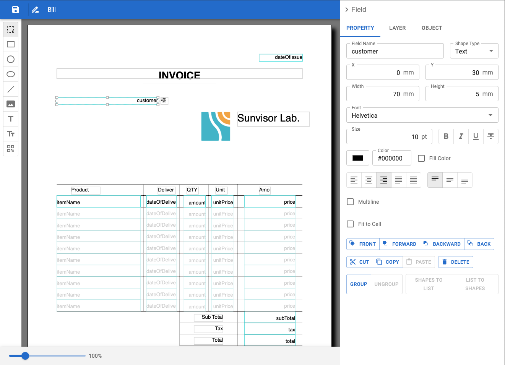

Super Leopard - Report generation library
==============================

Super Leopard is a library for creating reports.
It can add data to a template written in a specified format and output a PDF.
The template data is expressed in JSON, but a GUI is provided for editing on a web screen.
Super Leopard is intended to be incorporated into your application to provide flexible report generation functionality.

We are currently developing it for release.

[日本語の解説はこちら(Japanese document is here)](./docs/ja/README.md)

Super Leopard features
-------------------

- Outputs a PDF report from a template and data
- Displays a report on a web page from a template and data
- Edits a template on a web page

Project structure
-------------------

This repository is structured using npm workspace.
The workspace structure is as follows.

```
.
├── packages
│ ├── component
│ ├── core
│ ├── pdf
```

- packages/core: Super Leopard core library
- packages/component: Super Leopard GUI library
- packages/pdf: PDF output library

### core library

This provides a model that defines each element of a report template (called a Report).
Reports can be defined in JSON. The syntax is described in the [core documentation](packages/core/README.md).
However, there is no need to memorize the syntax.
The reports can be generated using the GUI defined in the component library.

This library basically prints reports (templates) defined in JSON by providing data.
The core library defines the format and basic behavior of the underlying reports.
If you need a report that outputs something other than web or PDF, you can create it using the core library.

### pdf library

This provides a library for outputting PDF.
You can output PDFs using HTTP servers such as Express or Fastify, or desktop apps such as Electron.
This library uses PDFKit for creating PDF.

### component library

This provides a function to display forms on a web screen and a GUI for editing form templates.
You can edit templates on a web screen.
The component is implemented using React and MUI.
We also use jotai for state management.




License
-------

MIT
