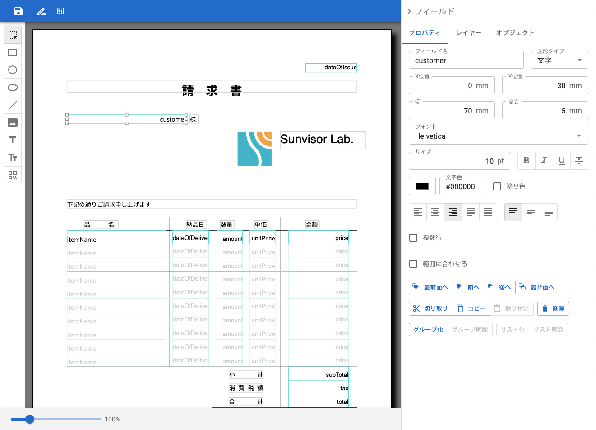

Super Leopard component パッケージ
==============================

レポートの作成は、テキストエディタを使ってレポートの定義を JSON で記述して作ることができます。
しかしそれは、とても面倒で時間のかかる作業になります。
また、完成したレポートをアプリケーションに組み込んだあとも、帳票のデザインに修正を加える必要があるかもしれません。

Super Leopard の component パッケージでは、レポートを作成するための GUI コンポーネントを提供します。

このコンポーネントを使って、レポートのエディタを作成したり、アプリケーションに組み込んでエンドユーザーが直接レポートの定義を編集してもらうことができます。

コンポーネント
--------------

多くのコンポーネントで構成されていますが、メインのコンポーネントは次のようになります。

- `ReportEditor`: レポートの定義を編集するための GUI コンポーネント
- `Report`: レポートを表示するための GUI コンポーネント

その他のコンポーネントは、これら２つのコンポーネントが利用しているものです。

Report Editor
-------------

### プロパティ

- `report`: (オプション) レポートの定義
- `reportId`: レポートの識別子
- `title`: レポートのタイトル
- `language`: (オプション) エディタで使用する言語
- `onSave`: レポートの定義を保存したときに呼び出されるコールバック
- `settings`: (オプション) 設定情報

Report
-------

### プロパティ

レポートにデータを与え、画面にプレビューを表示します。
リスト形式のレポートで複数のページに渡る場合は、`pageNumber` で指定したページが表示されます。

- `report`: レポートの定義
- `values`: レポートに与えるデータ
- `listRecords`: レポートに与えるリストデータ
- `pageNumber`: (オプション) 表示するページの番号
- `zoom`: (オプション) 表示するスケール(%)
- `settings`: (オプション) 設定情報
